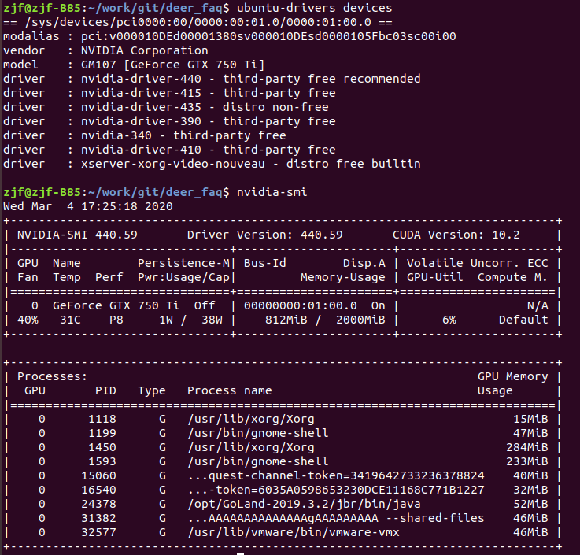

## ntfs support

> sudo apt install ntfs-config

## ifconfig

> sudo apt install net-tools

## other

> sudo apt install git make g++ vim

## golang

```shell
sudo vim /etc/profile

# GO ENVIRONMENT SETTING
export GOROOT=/usr/local/go
export GOPATH=$HOME/go
export PATH=$GOPATH/bin:$GOROOT/bin:$PATH

source /etc/profile

go version
go env -w GO111MODULE=on
go env -w GOPROXY=https://goproxy.cn,direct
```

## vim
```
sudo vim /etc/vim/vimrc

set nu
set ts=4
set hlsearch
syntax on
```

## TDengine
```
sudo systemctl start taosd
sudo systemctl status taosd
```

## redis

```
sudo apt install redis-server
redis-server
redis-cli  -h 127.0.0.1 -p 6379 -a 123456
sudo snap install redis-desktop-manager
```

## socketpro

```
sudo apt-get install build-essential autoconf libtool libssl-dev libpcre3 libpcre3-dev asciidoc xmlto libz-dev zlib1g-dev
git clone https://github.com/shadowsocksr-backup/shadowsocksr-libev.git ~/socketpro/client
cd ~/socketpro/client
./configure && make
sudo make install
ss-local -h

ss-local -c ~/socketpro/PHK1.json 
```

## mstsc

```
sudo apt install xrdp
sudo vim /etc/xrdp/startwm.sh
并将最后两行test和exec用#注释掉，在最后一行添加gnome-session
```

## insomnia

```
sudo snap install insomnia
```

## postman

> sudo tar zxf Postman-linux-x64-7.19.1.tar.gz -C /opt/

给Postman添加快捷访问方式：

执行命令：sudo ln -s /opt/Postman/Postman /usr/bin/postman

执行命令：cat > ~/.local/share/applications/postman.desktop <<EOL

输入下面的代码后，按两次enter键或ctrl+d退出：

[Desktop Entry]

Encoding=UTF-8

Name=Postman

Exec=postman

Icon=/opt/Postman/app/resources/app/assets/icon.png

Terminal=false

Type=Application

Categories=Development;

EOL


## VMware Workstation Pro 15 激活许可证

```
UY758-0RXEQ-M81WP-8ZM7Z-Y3HDA
VF750-4MX5Q-488DQ-9WZE9-ZY2D6
UU54R-FVD91-488PP-7NNGC-ZFAX6
YC74H-FGF92-081VZ-R5QNG-P6RY4
YC34H-6WWDK-085MQ-JYPNX-NZRA2
```

## 截图快捷键

Ctrl+Shift+Print

## 搜狗输入法

区域和语言 - 管理已安装的语言 - 键盘输入法 选择 fcitx 重启


## typora
```
# or run:
# sudo apt-key adv --keyserver keyserver.ubuntu.com --recv-keys BA300B7755AFCFAE

wget -qO - https://typora.io/linux/public-key.asc | sudo apt-key add -

# add Typora's repository

sudo add-apt-repository 'deb https://typora.io/linux ./'

sudo apt-get update

# install typora

sudo apt-get install typora
```

## uget+aria2

```
sudo add-apt-repository ppa:plushuang-tw/uget-stable
sudo add-apt-repository ppa:t-tujikawa/ppa
sudo apt-get update
sudo apt-get install uget aria2
```

uget->编辑->设置->插件 选择aria2


# nvidia driver

拿到了一台新机子，带显卡的那种，当然是各种倒腾了！于是我又一天装了三遍机子来进行各种尝试熟悉配置啥的。

所以首先是在裸机上安装Nvidia驱动。

环境：Ubuntu18.04

刚安装完系统，当然是把软件更新器提出的下载更新给下载一下了。所以首先应该是

> sudo apt-get update

当然，上述是系统主动提出的更新，并没有输入指令啦~

接下来，为了安装较新的驱动，先将ppa源加入

> sudo add-apt-repository ppa:graphics-drivers/ppa
> sudo apt-get update

然后就可以直接进行显卡驱动的安装了

> ubuntu-drivers devices

这个指令会列出当前的显卡和可安装的驱动，并会在推荐驱动后面显示recommend

我直接安装推荐的驱动（应该要等比较久，不过很可能是网比较渣）：

> sudo ubuntu-drivers autoinstall

安装完重启：

> sudo reboot

然后查看一下显卡信息：

> nvidia-smi

如果有个表格式的信息显示出来，就说明安装成功啦

